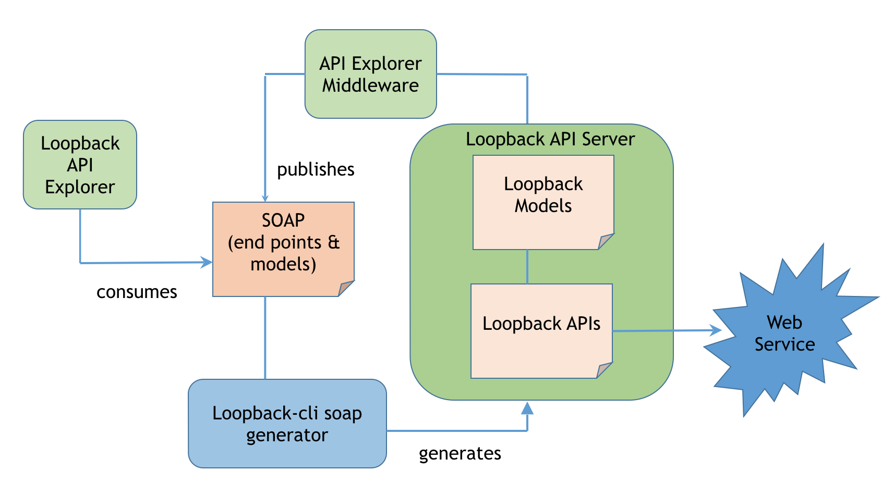
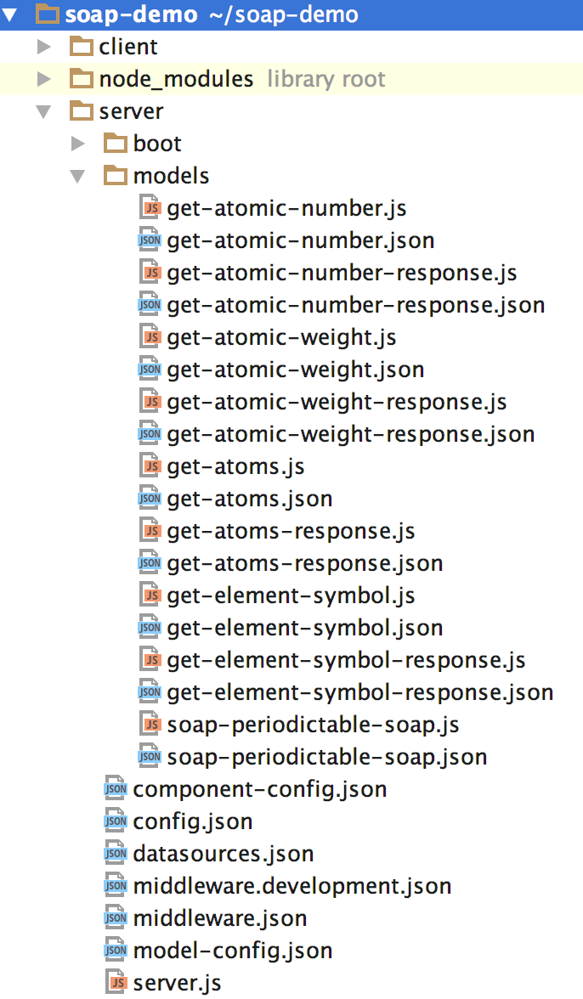
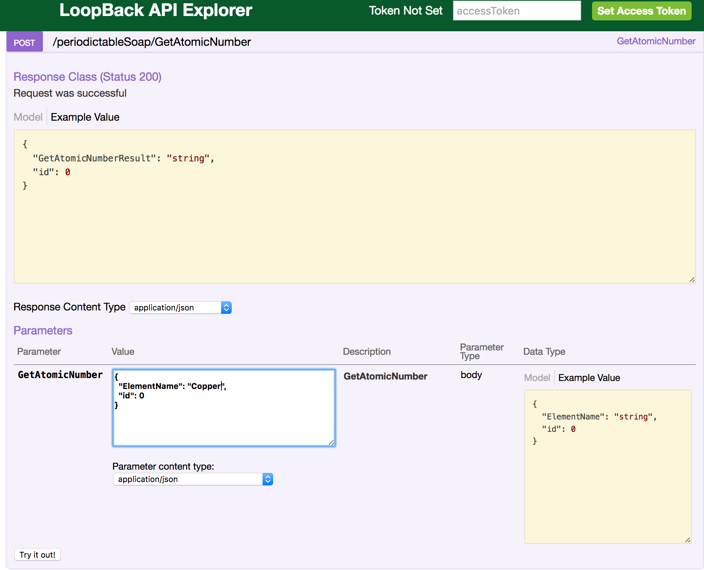

# API design first with LoopBack and SOAP Web Service

## What is LoopBack?

[LoopBack](http://loopback.io) is an open source Node.js API framework from [StrongLoop](http://www.strongloop.com). 
It is built on top of Express optimized for mobile, web, and other devices.  LoopBack makes 
it really easy and productive for developers to define, build and consume APIs. Define data 
models, connect to multiple data sources, write business logic in Node.js, glue on top of your
existing services and data, and consume using JS, iOS & Android SDKs.

## What is Web Service/SOAP/WSDL?

Web services is a technology which lets applications to talk to each other independent 
of platform and language. A web service is a software interface which describes a collection 
of operations that can be invoked over the network through standardized XML messaging using 
[SOAP](https://www.w3.org/TR/soap/)(Simple Object Access Protocol). [WSDL](https://www.w3.org/TR/wsdl20/)(Web Services Description Language) is an 
XML formatted document which describes the Web Service endpoint, bindings, operations 
and schema.

## LoopBack + SOAP = REST API

 

In many Enterprises, Web Services are still important and the way to access these
Web Services is still via SOAP. SOAP is fairly heavy weight, and working with XML-based SOAP 
payloads in Node.js is not easy.  It’s much easier to use JSON and to wrap or mediate a SOAP 
service and expose it as a REST API. To support API design first approach, 'lb soap' feature
supports generation of JSON models and REST APIs for SOAP Web Services operations. These operations 
can invoke Web Service without user writing any client code.

## Scaffolding a LoopBack application from SOAP Web Services datasource

Before we start, please make sure you have loopback-cli installed:

```sh
npm install -g loopback-cli
```
For more information, see https://github.com/strongloop/loopback-cli

### Create a loopback application

The first step is to create a blank loopback application. For e.g soap-demo

```sh
lb app
```
Select 3.x or 2.x Loopback version. When prompted 'What kind of application do you have in mind?', 
select 'empty-server' for this demo purpose.


### Create a SOAP Web Services datasource

```sh
cd soap-demo
```

The next step is to create SOAP Web Services datasource. In this demo, we will create a SOAP datasource
for an externally available Periodic Table Web Service: http://www.webservicex.net/periodictable.asmx?WSDL                                                                                                          

```sh
lb datasource
```
Here are the steps to create SOAP Web Services datasource for Periodic Table Web Service.

- Enter the data-source name, e.g 'periodicSoapDS'
- Scroll through and select 'Soap Webservices(supported by StrongLoop)' from the list of connectors.
- Enter http://www.webservicex.net/periodictable.asmx for 'URL to the SOAP web service endpoint' prompt.
- Enter http://www.webservicex.net/periodictable.asmx?WSDL for 'HTTP URL or local fie system path to WSDL file' prompt.
- Enter 'Y' to Expose operations as REST APIs.
- Leave blank to 'Maps WSDL binding operations to node.js methods'
- Select 'Y' to 'Install 'loopback-connector-soap' prompt. 'lb soap' feature will not work if loopback-connector-soap
  is not installed.

Refer [SOAP data source properties](http://loopback.io/doc/en/lb3/SOAP-connector.html) for detail information on SOAP datasource properties.


### Generate APIs from SOAP Web Services datasource

Now let's try to generate models and APIs from SOAP Web Services datasource.

```sh
lb soap
```
This prompts list of SOAP Web Service datasources you have created for this app. For this demo it will just
show 'periodicSoapDS' since we created only this datasource so far. Select the datasource from the list.


The generator then discovers list of services defined in the WSDL for the selected datasource. 
Select the service from a list of services.


Once a 'service' is selected, it will discover and list bindings defined for the selected service. 
Select a binding.


Once a 'binding' is selected, it will then discover and list SOAP operations defined in the selected binding.
Select one or more SOAP operation/s.


Once one or more operation/s are selected, the project will generate remote models and REST API which can 
invoke the external Web Service which is running at (http://www.webservicex.net/periodictable.asmx).

### Check the project

The models and corresponding JS files are generated into the server/models folder:


- server/model-config.json: Config for all models

- here are some of the server/models files: 

  - soap-periodictable-soap.json: model to host all APIs
  - soap-periodictable-soap.js: JS file containing all APIs which can invoke Web Service operations.
  - get-atomic-number.json: GetAtomicNumber definition
  - get-atomic-number.js: GetAtomicNumber extension
  - get-atomic-weight.json: GetAtomicWeight model definition
  - get-atomic-weight.js: GetAtomicWeight model extension
  - etc

### Run the application

To run the application:
```sh
node .
```

Open your browser and points to http://localhost:3000/explorer.


As you see, SOAP operations defined in the WSDL document is now available from LoopBack!

Let's give a try:

- Click on 'GetAtomicNumber' API.
- Under 'Parameters' click on 'Example Value' text box. This will fill in 'GetAtomicNumber' value text box. 
- Fill in the 'ElementName' as 'Copper' or 'Iron' or any element name from the periodic table. 
- Click on 'Try it out' button. 



This will invoke the REST API which is generated in soap-periodictable-soap.js. This REST API in turn  
invokes the periodic table Web Service hosted at (http://www.webservicex.net/periodictable.asmx) returning SOAP result 
back to the API explorer. 


## Summary

With the 'lb soap' command, we now have the complete round trip: 
- Start with a SOAP Web Service datasource.
- Generate corresponding models and APIs to invoke SOAP operations.
- Play with the live APIs served by LoopBack using the explorer.
- Invoke the Web Service through your REST API.
