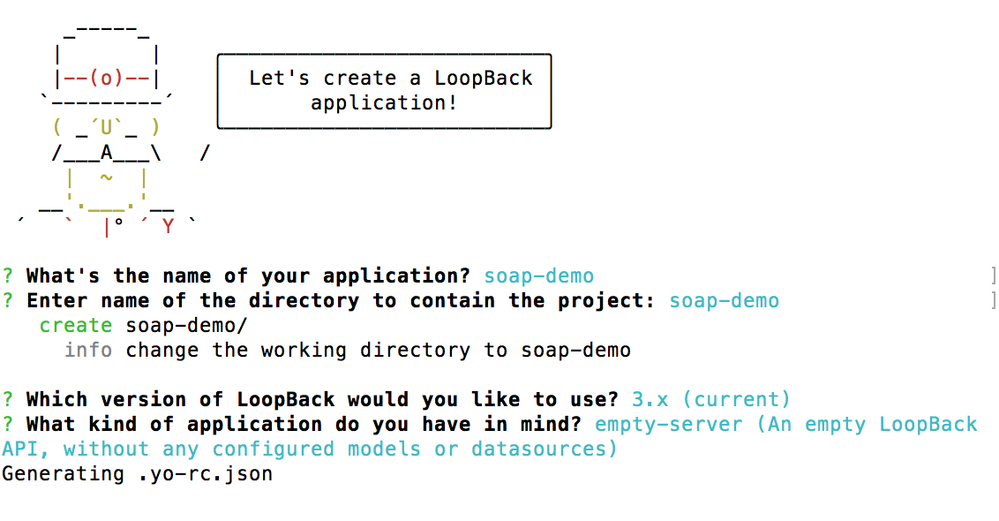
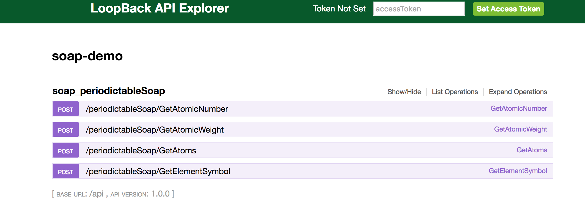

# API design first with LoopBack and SOAP Web Service

## What is LoopBack?

[LoopBack](http://loopback.io) is an open source Node.js API framework from [StrongLoop](http://www.strongloop.com). 
It is built on top of Express optimized for mobile, web, and other devices.  LoopBack makes 
it really easy and productive for developers to define, build and consume APIs. Define data 
models, connect to multiple data sources, write business logic in Node.js, glue on top of your
existing services and data, and consume using JS, iOS & Android SDKs.

## What is Web Service/SOAP/WSDL?

Web services is a technology which lets applications to talk to each other independent 
of platform and language. A web service is a software interface which describes a collection 
of operations that can be invoked over the network through standardized XML messaging using 
SOAP(Simple Object Access Protocol). WSDL(Web Services Description Language) is an 
XML formatted document which describes the Web Service endpoint, bindings, operations 
and schema.

## LoopBack + SOAP = REST API

 

In many Enterprises, Web Services are still important and the way to access these
Web Services is still via SOAP. SOAP is fairly heavy weight, and working with XML-based SOAP 
payloads in Node.js is not easy.  It’s much easier to use JSON and to wrap or mediate a SOAP 
service and expose it as a REST API. To support API design first approach, 'lb soap' feature
supports generation of JSON models and REST APIs for WSDL/SOAP operations. These operations 
can invoke Web Service without user writing any client code.

## Scaffolding a LoopBack application from WSDL

Before we start, please make sure you have loopback-cli installed:

```sh
npm install -g loopback-cli
```
For more information, see https://github.com/strongloop/loopback-cli

### Create a loopback application

The first step is to create a blank loopback application. For e.g soap-demo

```sh
lb app
```
Select 3.x or 2.x Loopback version. When prompted 'What kind of application do you have in mind?', 
select 'empty-server' for this demo purpose.



### Generate APIs from WSDL

Now let's try to generate APIs from WSDL document. Note: There is an enhancement planned to generate 
APIs given SOAP Web Service data source.

```sh
cd soap-demo
lb soap
```
When prompted, provide an url or local file path to the WSDL. In this demo, we will use WSDL from an 
externally available Web Service:

http://www.webservicex.net/periodictable.asmx?WSDL

The generator loads the WSDL and discovers services defined in the WSDL. It then prompts you to 
select the service from a list of services.


Once a 'service' is selected, it will discover and list bindings defined for the selected service. 
Select a binding.


Once a 'binding' is selected, it will then discover and list SOAP operations defined in the selected binding.
Select one or more SOAP operation/s.


Once one or more operation/s are selected, the project will generate remote models and REST API which can 
invoke the external Web Service which is running at (http://www.webservicex.net/periodictable.asmx).

### Check the project

The models and corresponding JS files are generated into the server/models folder:


- server/model-config.json: Config for all models

- here are some of the server/models files: 

  - soap-periodictable-soap.json: model to host all APIs
  - soap-periodictable-soap.js: JS file containing all APIs which can invoke Web Service operations.
  - get-atomic-number.js: GetAtomicNumber definition
  - get-atomic-number.js: GetAtomicNumber extension
  - get-atomic-weight.json: GetAtomicWeight model definition
  - get-atomic-weight.js: GetAtomicWeight model extension
  - etc

Install 'strong-soap' node module for this soap-demo app. This is a workaround until enhancement to use 
the SOAP datasource instead of WSDL is supported.

```
npm install strong-soap --save
```

### Run the application

To run the application:
```sh
node .
```

Open your browser and points to http://localhost:3000/explorer.



As you see, SOAP operations defined in the WSDL document is now available from LoopBack!

Let's give a try:

- Click on 'GetAtomicNumber' API.
- Under 'Parameters' click on 'Example Value' text box. This will fill in 'GetAtomicNumber' value text box. 
- Fill in the 'ElementName' as 'Copper' or 'Iron' or any element name from the periodic table. 
- Click on 'Try it out' button. 


This will invoke the REST API which is generated in soap-periodictable-soap.js. This REST API in turn  
invokes the periodic table Web Service hosted at (http://www.webservicex.net/periodictable.asmx) returning SOAP result 
back to the API explorer. 


## Summary

With the 'lb soap' command, we now have the complete round trip: 
- Start with a SOAP WSDL document.
- Generate corresponding models and APIs to invoke SOAP operations.
- Play with the live APIs served by LoopBack using the explorer.
- Invoke the Web Service through your REST API.
